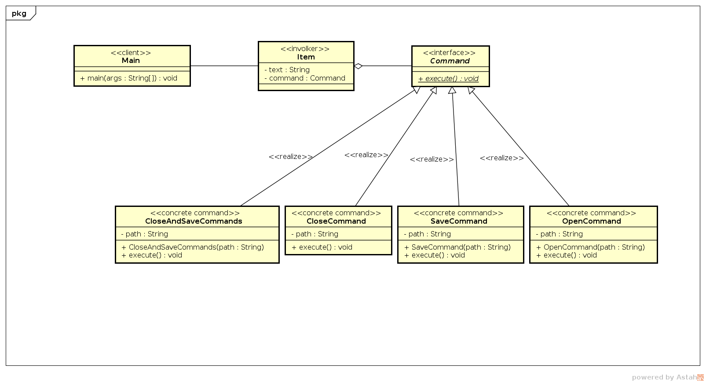

# Objetivo

“Encapsular uma solicitação como objeto, desta forma permitindo parametrizar cliente com diferentes solicitações, enfileirar ou fazer o registro de solicitações e suportar operações que podem ser desfeitas.” [1]

Como pode ser notado, o **pattern** **command** pode ser utilizado em várias situações. Para nossa problemática, o utilizaremos para encapsular as simulações de cliques em um menu.

# Problemática

Você como desenvolvedor precisa para o seu software, implementar um menu de opções. No acordo com o seu contratante o software entraria em pré produção a cada final de sprint desenvolvida, contudo o seu patrão solicitou que as opções no menu só estivessem disponíveis após terem sido implementadas. Neste menu cada item tem uma ação única no evento de clique. Como você pode desenvolver esse menu sem sofrer um _overhead_ que será causado por ter que a toda implementação atualizar a classe MenuItem, responsável por controlar os items.

# Solução

O _pattern_ _command_ pode solucionar esse problema fazendo com que cada vez que um novo possível comando de menu exista, seja necessário programar apenas a ação desse nova ação de clique e no fim apenas adicionar o item novo no menu, com apenas 2 (duas) linhas.

No diagrama de classe abaixo temos um exemplo de implementação que soluciona esse problema, sendo ela no âmbito mais didático.

O código que tem esta implementação pode ser encontrado [aqui](code/).

Note que a cada vez que surgir um novo item, é apenas necessário implementar a interface _Command_ que o sistema inteiro já o deixará pronto para uso.

# Pattern

Este _pattern_ consiste em pelo menos uma classe _client_ que é a que utilizará o _pattern_, uma classe _invoker_, que é responsável por executar a solicitação, uma interface que é o core do _pattern_ e a(s) classe(s) _concrete_ _method_ que são as classes com a implementação das solicitações que podem ser feitas. 

# Referências

[1] GAMMA, Erich et al. Padrões de Projeto: Soluções reutilizáveis de software orientado a objetos.

